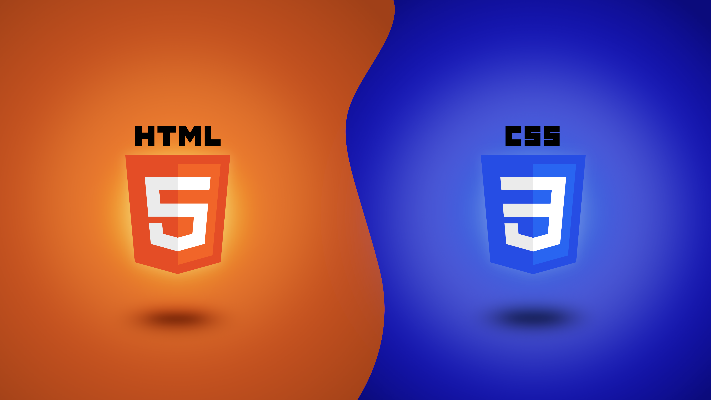

# HTML5-CSS3
 
 

    Curso de HTML5 e CSS3 criado pelo professor <a href="https://github.com/gustavoguanabara" target="_blank" rel="external">Gustavo Guanabara</a> para o <a href="https://www.youtube.com/@CursoemVideo" target="_blank" rel="external">Curso em Vídeo</a>. Abrangindo as diversas técnicas contidas nas linguagens de marcações, esse curso, antes feito de forma mais simples em 2013, busca expandir e explorar as principais linguagens de marcação contidas em sites na internet; dentre elas, há o HTML, que serve como uma estrutura semântica, e CSS, que é utilizada para desenvolver o design dos documentos criados.
 

 

 <h2>Conteúdo</h2>

 

    Nesse repositório, desenvolvo exercícios e desafios presentes nos capítulos do <a href="https://www.youtube.com/watch?v=Ejkb_YpuHWs&list=PLHz_AreHm4dkZ9-atkcmcBaMZdmLHft8n" target="_blank" rel="external">curso de HTML e CSS</a> do Curso em Vídeo, criado por <a href="https://www.cursoemvideo.com/blog/dicas/professor-gustavo-guanabara-conquista-o-1o-lugar-no-github/" target="_blank" rel="external">um dos mais renomados e atenciosos professores de tecnologia do mundo</a>, Gustavo Guanabara. Embora o curso apresente um material muito simples e direto, ele é essencial para a criação de habilidades e formação de novos programadores. Já não bastava o curso ser gratuito, ele ainda se atenta em informar e ajudar os profissionais de todas as maneiras possíveis, desde dicas para melhorar seu código, até indicar programas para ajudar em tarefas diversas, como manipulação de imagens e formatação de vídeos, para aperfeiçoar o conteúdo do site.
 

 <h3>Nesse curso, os seguintes tópicos seram explorados:</h3>

 <ul>
    <li><a href="https://www.youtube.com/watch?v=Ejkb_YpuHWs&list=PLHz_AreHm4dkZ9-atkcmcBaMZdmLHft8n" target="_blank" rel="external">Módulo 1</a> - Conceitos básicos, preparação do ambiente, semântica da HTML5, textos, títulos, ligações, multimídia, estilos;</li>
    <li><a href="https://www.youtube.com/watch?v=vPNIAJ9B4hg&list=PLHz_AreHm4dlUpEXkY1AyVLQGcpSgVF8s" target="_blank" rel="external">Módulo 2</a> - Fundamentos do design, psicologia das cores, tipografia, elementos CSS, modelo de caixas, wireframe, responsividade;</li>
    <li><a href="https://www.youtube.com/watch?v=ofFgnDtn_1c&list=PLHz_AreHm4dmcAviDwiGgHbeEJToxbOpZ" target="_blank" rel="external">Módulo 3</a> - Versionamento de software, hospedagem de sites estáticos, tabelas;</li>
    <li><a href="https://www.youtube.com/watch?v=zHKHMmEG9vE&list=PLHz_AreHm4dkcVCk2Bn_fdVQ81Fkrh6WT" target="_blank" rel="external">Módulo 4</a> - Quadros em linha, formulários, media queries, mobile first;</li>
    <li>Módulo 5 - Flexbox e Grid Layout.</li>
 </ul>

 <h2>Documentos</h2>

 <ul>
   <li><a href="Curso%20em%20V%C3%ADdeo/Exercicios/M%C3%B3dulo%201/Hall%20exerc%C3%ADcios%201.html" target="_self" rel="next">Exercícios módulo 1</a></li>
   <li><a href="Curso%20em%20V%C3%ADdeo/Exercicios/M%C3%B3dulo%202/Hall%20exerc%C3%ADcios%202.html" target="_self" rel="next">Exercícios módulo 2</a></li>
   <li><a href="Curso%20em%20V%C3%ADdeo/Exercicios/M%C3%B3dulo%203/Hall%20exerc%C3%ADcios%203.html" target="_self" rel="next">Exercícios módulo 3</a></li>
   <li><a href="Curso%20em%20V%C3%ADdeo/Exercicios/M%C3%B3dulo%204/Hall%20exerc%C3%ADcios%204.html" target="_self" rel="next">Exercícios módulo 4</a></li>
   <li><a href="Curso%20em%20V%C3%ADdeo/Exercicios/M%C3%B3dulo%205/Hall%20exerc%C3%ADcios%205.html" target="_self" rel="next">Exercícios módulo 5</a></li>

   <li><a href="Curso%20em%20V%C3%ADdeo/Desafios/M%C3%B3dulo%201/Hall%20desafios%201.html" target="_self" rel="next">Desafio módulo 1</a></li>
   <li><a href="Curso%20em%20V%C3%ADdeo/Desafios/M%C3%B3dulo%202/Hall%20desafio%202.html" target="_self" rel="next">Desafio módulo 2</a></li>
   <li><a href="Curso%20em%20V%C3%ADdeo/Desafios/M%C3%B3dulo%203/Hall%20desafios%203.html" target="_self" rel="next">Desafio módulo 3</a></li>
   <li><a href="Curso%20em%20V%C3%ADdeo/Desafios/M%C3%B3dulo%204/Hall%20desafios%204.html" target="_self" rel="next">Desafio módulo 4</a></li>
   <li><a href="Curso%20em%20V%C3%ADdeo/Desafios/M%C3%B3dulo%205/Hall%20desafios%205.html" target="_self" rel="next">Desafio módulo 5</a></li>
 </ul>

 <h2>Atualizações</h2>

 <h3>Atualização de avanço no curso - 16 de Junho de 2023</h3>
 
 

    Por enquanto, apenas os documentos do módulo 1 e 2 estão completos, então não há muito o que explorar por aqui, já que se trata de documentos iguais aos criados nas aulas do curso (além de ser um conteúdo facilmente replicável, ele provavelmente é o primeiro passo da maioria das pessoas na programação). Tive o intuito de colocar os projetos aqui por duas razões: primeiro, o curso pede (lol), e segundo, para salvar e documentar meu progresso na programação e gerar uma perspectiva do desenvolvimento dos meus códigos para a contribuição da comunidade e de nossa área em geral. Começarei o módulo 3 hoje.
 

